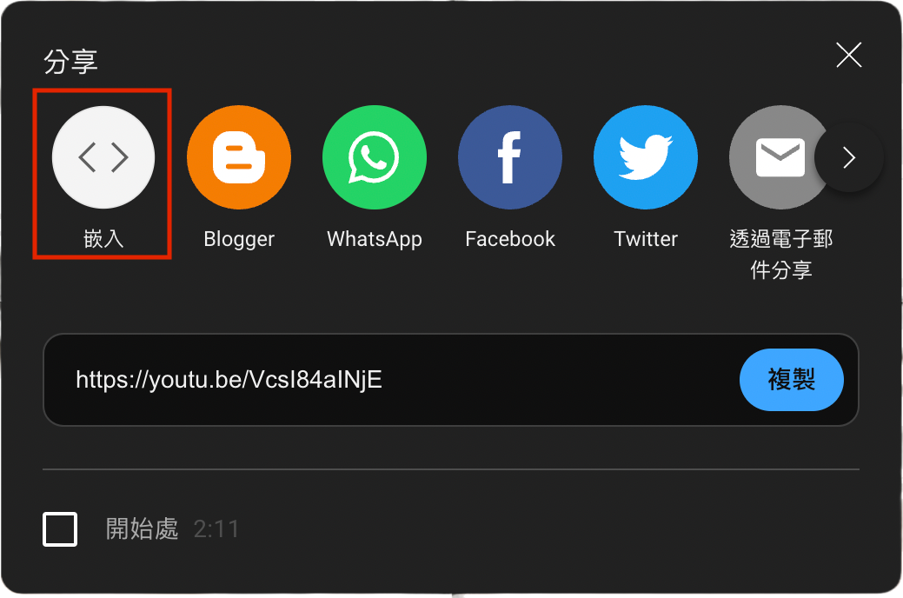

# Swing Dance 舞蹈工作室 Demo Site

## 實作網址
gh-pages : https://judy-nihao.github.io/swing-dance-demo

GitHub Repo : https://github.com/Judy-Nihao/swing-dance-demo

## 實作功能

- 表頭背景圖固定畫面捲動營造錯位
- 捲軸捲動動畫滑入
- 解決 nav bar 跳至分頁章節時遮擋內容頂端問題
- RWD 行動版版面調整


## 筆記

### header 背景圖固定畫面錯位效果

通常捲軸滾動時，畫面上的圖片都會跟著被捲走，但這種背景固定，不隨著滾動，彷彿背景跟文字有分圖層的錯位效果很常見，瀏覽網頁時多了一點動感。


設定的關鍵在於，使用 `::before`偽元素製造出一個區塊元素，對此元素施以絕對定位，寬高 100% 撐滿父層 `<header>` ，用`background-image`顯示背景圖片，再來最重要的屬性就是 `background-attachment: fixed` ，就能將背景固定在畫面上，但同時 `<header>` 內的文字依然能正常隨滾動滑走，創造出錯位滾動的視覺效果。

```css!
header:before {
    content: "";
    display: block;
    width: 100%;
    height: 100%;
    position: absolute;
    background-image: url(img/swing_dance-color.jpg);
    background-position-x: 20%;
    background-repeat: no-repeat;
    background-size: cover;
    background-attachment: fixed;
    filter: brightness(0.5);
    z-index: -1;
}
```


### 讓 `<iframe>` 內的 Youtube 影片可以彈性縮放

關鍵在於多包一層容器，而且內外都不寫死容器高度，高度用 `padding` 撐開。

- Youtube 網址必須要複製的是「嵌入 embeded 」的網址才有`<iframe>`
- 移除`<iframe>` 網址內 Youtube 預設的寬高
- `<iframe>` 外面包一層父層容器

父層 ：`position: relative` (`embed-container`)
子層：`position: absolute` (`<iframe>`)




讓絕對定位 `<iframe>` 寬高都用相對值 100%，相對定位的父層 `.embed-container` 高度也不寫死，而是透過設定垂直 `padding`，撐出影片區塊的高度。

```css!
.embed-container {
    position: relative;
    max-width: 100%;
    padding: 200px 0;
}
```
```css!
iframe {
    position: absolute;
    top: 0;
    left: 0;
    width: 100%;
    height: 100%;
}
```

 如此一來，嵌入的 Youtube `<iframe` 區域就能隨螢幕寬度縮放。
 
### 解決 navbar 跳至分頁章節時遮擋內容頂端問題
 
#### `scroll-padding-top` 屬性
      
 單頁式網頁，會運用每一個網頁區塊 `<section>` 的 id ，使點擊 menu 頁籤時，畫面能跳到指定 id 名稱的區塊上。但是常常發生，移動到指定區塊時，滑動時不滑順，以及抵達區塊後，區塊最頂端卻被 navbar 給遮擋一小部分的狀況。
 
被擋住的是因為 navbar 是用 fixed 定位 + `top: 0`，位於視窗頁面最上層，也最頂端。

而點擊 id 滑動到指定區塊時，區塊的頂端也是對位到視窗頁面頂端，所以會被處於最上層的 navbar 擋住。

這兩個狀況可以對 `html` 元素設定兩種 CSS 屬性改善

- scroll-behavior：讓滑動變得滑順
- scroll-padding-top：滑動到指定區域時，上退指定高度。

要讓區塊不要被擋住，關鍵在於知道 navbar 當下的實際高度為何，將這個高度數值設定給 `scroll-padding-top`，就能解決被擋住的問題。

 
```css!
html{
    scroll-padding-top: 58.875px;
}


:root {
    scroll-behavior: smooth;
}

```

#### jQuery `outerHeight()` 屬性 ( Property )

`outerHeight()` 可以取得一個元素的總高度，包含：「height」、「padding」和「border」。

如果想連「margin」也算進來，要寫成 `.outerHeight(true)`。

括號內預設 false 表示不包含外距 ， `outerHeight(false)` 就是不包含邊框。


> **[jQuery](https://api.jquery.com/outerheight/#outerHeight-includeMargin)**
Get the current computed outer height (including padding, border, and **optionally** margin).
> **`.outerHeight(false(預設) / true )`**
A Boolean indicating whether to include the element's margin in the calculation.


**搭配 jQuery 以及 `outerHeight()` 就可以取得 navbar 精確到小數點的高度**

精確到小數點的數值，才能確保滑動到定位時，navbar 和區塊之間不會有一咪咪空隙露出來。

(如果兩者剛好底色顏色落差對比明顯，這一點小空隙會很顯眼。)

`outerHeight()` 回傳的是純數字，記得要將高度加上「px」，才拿去更改 html 元素的 `scroll-padding-top` 屬性。

 ```javascript=
 let navBarHeight = $("nav.navbar").outerHeight();
$('html').css("scroll-padding-top", navBarHeight + "px");
 ```
 


[參考：Stop fixed navigations covering content on scroll](https://www.youtube.com/watch?v=iGUSTyG-CYw&t=338s)